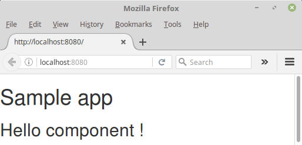

# 01 Hello React

En este ejemplo  crearemos nuestro primer componente react y lo conectaremos con el 
DOM via react-dom.

Tomaremos como punto de partida el ejemplo _00 Boilerplate

Resumen de pasos:

- Instalar react y react-dom.
- Instalar definiciones de typescript de react y react-dom.
- Actualizar el index.html para crear un sitio para los componentes react.
- Crear un componente simple de react.
- Conectar este componente usando react-dom.

## Prerrequisitos

Instalar [Node.js and npm](https://nodejs.org/en/) (v6.6.0) si aún no están instalados en tu ordenador.

> Verificar que estás usando node v6.x.x y npm 3.x.x ejecutando `node -v` y `npm -v` en un terminal/console. Versiones viejas pueden provocar errores.

## Pasos para desarrollarlo:

- Copiar el contenido desde _00 Boilerplate_ y ejecutar _npm install_.


- Instalar las librerias react y react-dom:

````
npm install react react-dom --save
````
- Instalar las definiciones de typescript de react y react-dom:

````
npm install  @types/react-dom @types/react --save -dev
````

- Actualizar el index.html para crear un sitio para los componentes de react 

```html
<!DOCTYPE html>
<html>
  <head>
    <meta charset="utf-8">
    <title>React + ES6 by example</title>
  </head>
  <body>
    <h1>Sample app</h1>
    <div id="root">
    </div>    
  </body>
</html>
```

- Crear un componente react simple (lo creamos en un archivo llamado  _hello.jsx_)

```javascript
import React from 'react';

class HelloComponent extends React.Component {
  render () {
    return (<p> Hello React!</p>);
  }
}

export default HelloComponent;
```

- Conectamos este componente usando react-dom en el _main.jsx_ (tenemos que renombrar este fichero
  de js a jsx y remplazar el contenido).

```javascript
import React from 'react';
import ReactDOM from 'react-dom';
import HelloComponent from './hello.jsx';

ReactDOM.render(<HelloComponent/>, document.getElementById('root'));
```

- Modificar el `webpack.config.js` y cambiar el punto de entrada de `./main.js`
a `./main.jsx`.

 ```javascript
 entry: [
   './main.jsx',
   '../node_modules/bootstrap/dist/css/bootstrap.css'
 ],
 ```

 También necesitas modificar el primer babel loader para manejar ficheros jsx.
 Para manejar estos ficheros con webpack es necesario instalar babel-plugin-transform-runtime y babel-preset-react.

 ```
 npm install babel-plugin-transform-runtime babel-preset-react babel-preset-es2015 --save-dev
 ```

Luego en `webpack.config.js`:

 ```javascript
    rules: [
      {
        test: /\.jsx$/,
        exclude: /node_modules/,
        loader: 'babel-loader',
        query: {
          plugins: ['transform-runtime'],
          presets : ['es2015', 'react']
        }
      },
```

- Ejecutar el ejemplo:

 ```bash
 $ npm start
 ```

- Finalmente, carga http://localhost:8080/ en un navegador para ver el resultado.

 
