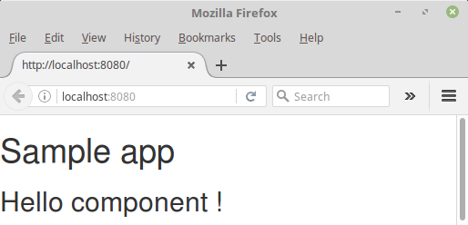

# 02 Properties

In this sample we will introduce a basic React concept, handling properties.

We will add a _userName_ property and display it in the _Hello_ component.

We will take as a starting point sample __[01 Hello React](../01%20HelloReact/)__:

Summary steps:

- Create a property in our _Hello_ stateless component that will hold the _userName_ value.

- Let's inform it from our parent control.

## Prerequisites

Install [Node.js and npm](https://nodejs.org/en/) if they are not already installed on your computer.

> Verify that you are running at least node v6.x.x and npm 3.x.x by running `node -v` and `npm -v` in a terminal/console window. Older versions may produce errors.

## Steps to build it

- Copy the content from _01 HelloReact_ and execute `npm install`.

- Delete the __[main.js](./src/main.js)__ file. Our webpack configuration will only recognize one of the two and there may be conflict. Remember!!! There should never be two files with the same entry name. 

- Let's update __[hello.jsx](./src/hello.jsx)__ in order to reflect the new property added (_userName_) and display it using interpolation (`{props.userName}`):

_[hello.jsx](./src/hello.jsx)_
```diff
import React from 'react';

-- export const HelloComponent = () =>
++ export const HelloComponent = (props) =>
--     <p> Hello React!</p>
++     <h2>Hello user: {props.userName}!</h2>
```

- Let's update __[main.jsx](./src/main.jsx)__ and inform the _userName_ propery value:

_[main.jsx](./src/main.jsx)_
 ```diff
-- const personToGreet = "ES6";
-- const messageToDisplay = `Hello ${personToGreet}!`;

-- document.write(messageToDisplay);

++ import React from 'react';
++ import {render} from 'react-dom';
++ import {HelloComponent} from './hello';

++ render(
++   <HelloComponent userName="John" />
++   , document.getElementById('root')
++ );
```

In this example we will only use the `render` method of React-DOM, so we will only import that (` import {render} from 'react-dom'; `).

Now we will modify the __[hello.jsx](./src/hello.jsx)__ to add a **proptypes** that will check the input variable to make sure it is strin type and required.

(We can expand information here: [https://github.com/facebook/prop-types](https://github.com/facebook/prop-types))

_[hello.jsx](./src/hello.jsx)_
```diff
import React from 'react';
++ import PropTypes from 'prop-types';

export const HelloComponent = (props) =>
     <h2>Hello user: {props.userName}!</h2>

++ HelloComponent.propTypes = {
++     userName: PropTypes.string.isRequired
++ };
```

**Important**: Don't forget to import the component that manages it, `import PropTypes from 'prop-types';`.

- Execute the example:

 ```bash
 npm run build
 ```

To generate the dist folder, and its contents, and

 ```bash
 npm start
 ```

- Then, load http://localhost:8080/ in a browser to see the output.

 