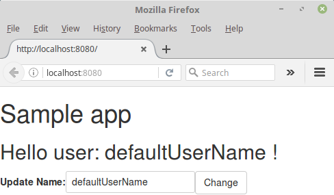

# 04 Callback + State

En esta demo, vamos a refactorizar la muestra anterior _[03 State](../03%20State/)_.

Actualizaremos la propiedad del nombre sólo cuando el usuario haga clic en el botón _change_, también simplificaremos el evento.

Obviamente, tomaremos la demo _[03 State](../03%20State/)_ como punto de partida.

Pasos resumidos:

- Agregue un botón al componente `EditName` y una función de controlador para esto.
- Envíe el nombre solo cuando el usuario haga clic en el botón.
- Actualice el componente `app` para manejar el nuevo evento simplificado.

## Requisitos previos

Instale [Node.js and npm](https://nodejs.org/en/) (v6.6.0 o más reciente) si aún no están instalados en su computadora.

> Verifique que esté ejecutando al menos node v6.x.x y npm 3.x.x, ejecutando `node -v` y` npm -v` en una ventana de terminal / consola. Las versiones anteriores pueden producir errores.

## Pasos para construirlo

- Copie el contenido de la carpeta _[03 State](../03%20State/)_ a una carpeta vacía para la muestra y conviértala en su carpeta actual.

- Instale los paquetes npm descritos en [package.json](./package.json) y verifique que funcionen:

```bash
npm install
```

- Como vamos a usar un controlador interno, transformaremos el `NameEditComponent` de un componente sin estado en un componente de clase, luego agregaremos un refactor a la nomenclatura.

El archivo [nameEdit.jsx](./src/nameEdit.jsx) debería verse así:

_[nameEdit.jsx](./src/nameEdit.jsx)_
```diff
import React from 'react';
import PropTypes from 'prop-types';

-- export const NameEditComponent = (props) => (
--  <div>
--    <label htmlFor="userName">Update Name:</label>
--    <input id="userName" value={props.userName} onChange={props.onChange} />
--  </div>
-- );

++ export class NameEditComponent extends React.Component {  
++  constructor(props) {
++    super(props);
++    // Watch out what would happen if we get this user name via an AJAX callback
++    // you will find a different implementatin on 05 sample
++    this.state = {
++      editingName: this.props.initialUserName,
++    };

++    this.onChange = this.onChange.bind(this);
++    this.onNameSubmit = this.onNameSubmit.bind(this);
++  }

++  onChange(event) {
++    this.setState({ editingName: event.target.value });
++  }

++  onNameSubmit() {
++    this.props.onNameUpdated(this.state.editingName);
++  }

++  render() {
++    return (
++      <div>
++        <label htmlFor="editingName">Update Name:</label>
++        <input value={this.state.editingName} onChange={this.onChange} id="editingName" />
++        <input type="submit" value="Change" className="btn btn-default" onClick={this.onNameSubmit} />
++      </div>
++    );
++  }
++ }

NameEditComponent.propTypes = {
   initialUserName: PropTypes.string.isRequired,
-- onChange: PropTypes.func.isRequired,    
++ onNameUpdated: PropTypes.func,
};
```

- Conectamos esto en el archivo [app.jsx](./src/app.jsx).

_[app.jsx](./src/app.jsx)_
```diff
import React from 'react';
import { HelloComponent } from './hello';
import { NameEditComponent } from './nameEdit';

export class App extends React.Component {
  constructor(props) {
    super(props);
    this.state = { 
        userName: 'defaultUserName',
    };
    this.setUsernameState = this.setUsernameState.bind(this);
  }
-- setUsernameState(event) {
++ setUsernameState(newName) {
      this.setState({ 
--      userName: event.target.value,        
++      userName: newName 
      });
  }

  render() {
    return (
      <div>
        <HelloComponent userName={this.state.userName} />
        <NameEditComponent
--        userName={this.state.userName}
++        initialUserName="Javier Cansado"
--        onChange={this.setUsernameState}  
++        onNameUpdated={this.setUsernameState}
        />
      a</div>
    );
  }
}
```

Ahora tenemos un evento claro, fuertemente tipado y simplificado (directo).

- Hagamos un intento:

```bash
npm start
```

- Luego, carga http://localhost:8080/ en un navegador para ver la salida.

 

Ahora, el saludo solo cambia cuando el usuario hace clic en el botón de cambio.

## Flujo en los componentes

* El componente principal `<App/>` está compuesto por dos subcomponentes.
    * `<HelloComponent/>`, recibe el estado de _userName_ (`userName = {this.state.userName}`) con un valor inicial _'defaultUserName'_, definido en `this.state = {userName: 'defaultUserName' }; ` dentro de  ` <App /> `( [app.jsx](./src/app.jsx) )
    * `<NameEditComponent/>`, recibe un valor inicial para _Username_ (`initialUserName =" Javier Cansado "`) y un método (`onNameUpdated = {this.setUsernameState}`) que cambia el valor de _Username_ state `setUsernameState(newName) {/*...*/}`.
* `<HelloComponent/>`, ( [hello.jsx](./src/hello.jsx) ), muestra el valor recibido en la variable _userName_.
* `<NameEditComponent/>`, ( [nameEdit.jsx](./src/nameEdit.jsx) ), tiene dos métodos:
    * `onChange (event) {}`, cambia el 'valor' cada vez que detecta un cambio en la entrada `<input value = {this.state.editingName} onChange = {this.onChange} id =" editingName "/> `.
    * `onNameSubmit () {}`, cambia el estado de _editingName_ que se cargará a `<App/>` y se le dará a `<HelloComponent/>`.